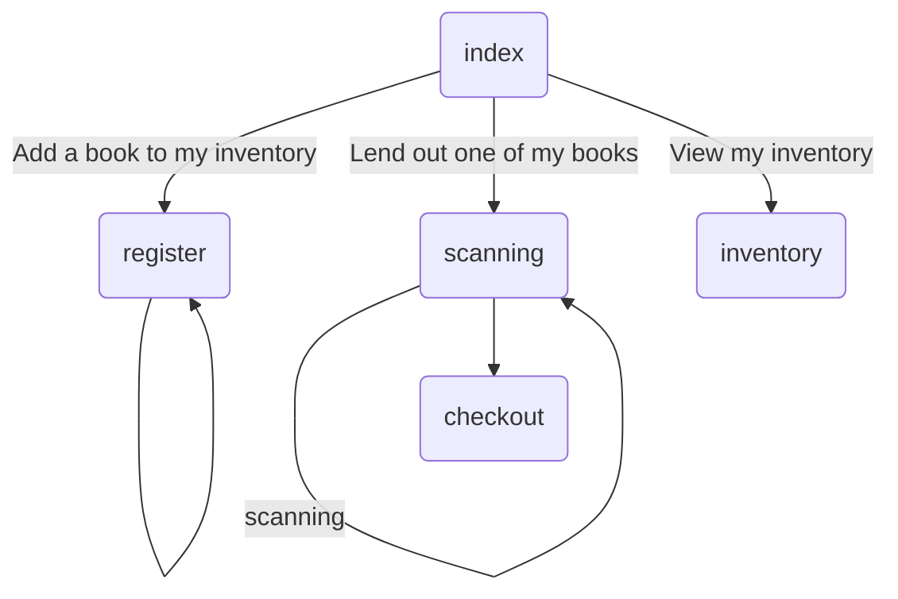

# Flask backend for RFID personal library
Hey there! You probably found this repo from my [slide deck](https://slides.com/dlindema/deck-25#/)


To run the application, you'll need:
- A Raspberry Pi that has been setup according to [this blog](https://pimylifeup.com/raspberry-pi-rfid-rc522/)
- 13.56 MHz RFID tags


## Running local
Since your local machine is unlikely to be able to expose SPI, you'll need to comment out imports in `routes.py` for
```
import RPi.GPIO as GPIO
from mfrc522 import SimpleMFRC522
reader = SimpleMFRC522()
```
as well as any code that utilizes the `reader` (found in `register_post()`
`scanning()`)

To get the dependencies and run

```
$ poetry install
$ poetry run app
```

On the RPI, poetry is difficult to install, so I'll provide a `pip freeze` of sorts that this project uses
```
RPi.GPIO
mfrc522
Flask
Flask-Migrate
Flask-SQLAlchemy
Jinja
SQLAlchemy
```


## Site Map

