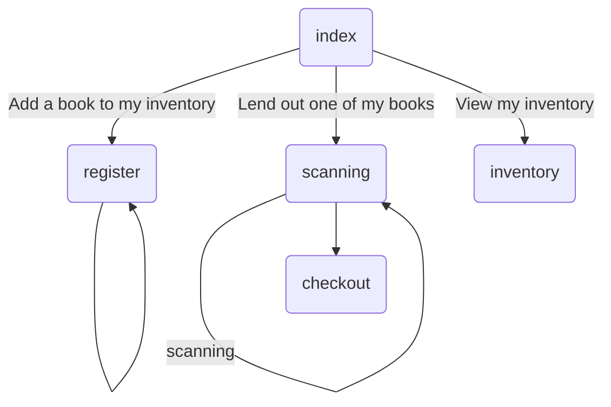

# Flask backend for RFID personal library

```
$ poetry install
$ poetry run app
```

## Site Map

```mermaid
graph TD
A(index ) -->|Add a book to my inventory| B(register)
A --> |Lend out one of my books|C(scanning)
B --> B
C --> |scanning|C
C --> E(checkout)
A -->|View my inventory| D(inventory)
```